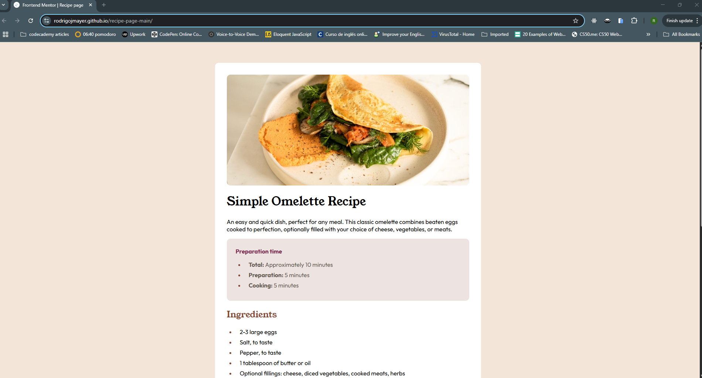

# Frontend Mentor - Recipe page solution

This is a solution to the [Recipe page challenge on Frontend Mentor](https://www.frontendmentor.io/challenges/recipe-page-KiTsR8QQKm). Frontend Mentor challenges help you improve your coding skills by building realistic projects. 

## Table of contents

- [Overview](#overview)
  - [The challenge](#the-challenge)
  - [Screenshot](#screenshot)
  - [Links](#links)
- [My process](#my-process)
  - [Built with](#built-with)
  - [What I learned](#what-i-learned)
  - [Continued development](#continued-development)
  - [Useful resources](#useful-resources)
- [Author](#author)
- [Acknowledgments](#acknowledgments)


## Overview

### Screenshot



### Links

- Live Site URL: [https://rodrigojmayer.github.io/recipe-page-main/](https://rodrigojmayer.github.io/recipe-page-main/)

## My process

### Built with

- Semantic HTML5 markup
- CSS custom properties
- Flexbox
- Mobile-first workflow


### What I learned

Using again basic practices as mobile first and flexbox, reinforcing old knowledge.

```html
<div class="nutri-flex">
        <div class="nutri-item">
          <p>Calories</p>
          <h4>277kcal</h4>
        </div>
        <hr>
        <div class="nutri-item">
          <p>Carbs</p>
          <h4>0g</h4>
        </div>
        <hr>
        <div class="nutri-item">
          <p>Protein</p>
          <h4>20g</h4>
        </div>
        <hr>
        <div class="nutri-item">
          <p>Fat</p>
          <h4>22g</h4>
        </div>
    </div>
```
```css
.nutri-flex hr{
    margin:0.3em 0;
}
.nutri-item {
    display: flex;
    /* flex-direction: row; */
    height: 25px;
    margin: 5px 0;
}
.nutri-item > * {
    flex: 1;
    padding: 0 1.5em;
    height: 50px;
    margin: 0;
}
.nutri-item > h4 {
    color: hsl(14, 45%, 36%);
}
@media (min-width: 768px) {       
    body {
        margin:8px;
    }main {
    width: 45em;
    border-radius: 10px;
    margin: 3em;

    }
    .image-omelette {
    width: calc(100% - 4em);
    border-radius: 10px;
    margin:2em 0 0 0;
    }
}
```


## Author

- Website - [rodrigojmayer](https://rodrigojmayer.github.io/portfolio/index.html)
- Frontend Mentor - [@rodrigojmayer](https://www.frontendmentor.io/profile/rodrigojmayer)
- Linkedin - [@rodrigojmayer](https://www.linkedin.com/in/rodrigojmayer/)